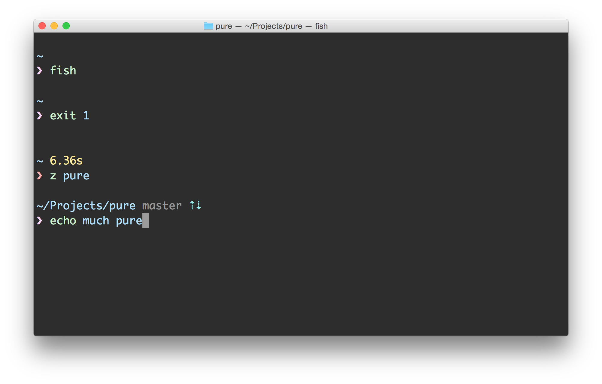

# Pure

> Pretty, minimal and fast [Fish](http://fishshell.com) prompt, inspired by [Pure for ZSH](https://github.com/sindresorhus/pure)

# Features
* Neat prompt character. Many thanks to Pure.ZSH for it.
* Shows git branch and whether it's dirty (with a *).
* Indicates when you have unpushed/unpulled git commits with up/down arrows.
* Automatically performs background git fetch.
* Prompt character turns red if the last command didn't exit with 0.
* Command execution time will be displayed if it exceeds the set threshold.
* Username and host only displayed when in an SSH or sudo session.
* Shows the current path in the title and the current folder & command when a process is running.
